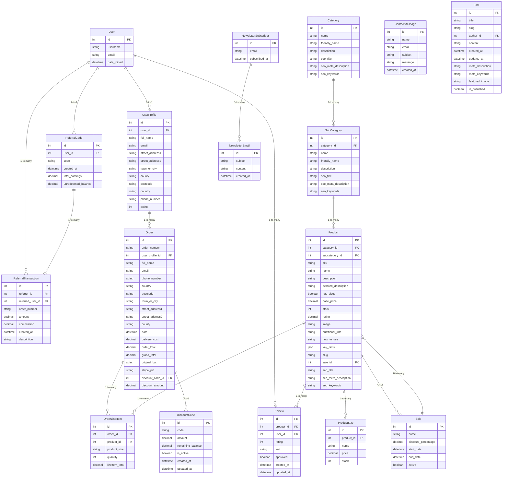

# Supplemint
## Introduction
Welcome to **Supplemint**, the premier online destination for high-quality nutritional supplements! Our e-commerce platform, built with the robust capabilities of Django, is designed to provide health enthusiasts and wellness seekers with a seamless shopping experience. From vitamins to protein powders, we offer a curated range of products to support your journey toward optimal health and well-being.

This project was developed as part of a full-stack web development course, showcasing a comprehensive application of Django, Python, the Stripe API for secure and efficient payment processing, and advanced web development best practices.

### View the live website [here](https://supplemint-ff2fe0e93175.herokuapp.com/)

## Features  

### Superior Product Selection  

- **Extensive Categories**: Browse a wide range of supplements organized into categories such as:  
    - **Vitamins**: Essential nutrients to support immunity and overall health.  
    - **Proteins**: High-quality protein powders and bars for muscle recovery.  
    - **Superfoods**: Nutrient-rich options like spirulina, acai, and chia seeds.  
    - **Herbs & Extracts**: Botanical extracts to promote energy and vitality.  
    - **Bioactives**: Micronutrients to enhance bodily functions.  
- **Subcategories**: Refine your search within each category for specific supplements.  

### Detailed Product Information  

- Each product page includes:  
    - Title and overview.  
    - Price and available sizes with different pricing.  
    - Stock levels and user ratings.  
    - Recommended products.  
    - Nutritional information and usage instructions.  
- **Review System**: Users can leave ratings and reviews to guide others.  

### Effortless Search and Sorting  

- **Search Bar**: Quickly locate products with an efficient search tool.  
- **Sorting Options**: Sort by name, price, or rating.  
- **Filters**: Filter by sale status, category, or price range.  

### Personalized User Experience  

- **User Accounts**: Features include:  
    - Profile management.  
    - Order history and tracking.  
- **Guest Checkout**: Option to shop without creating an account.  

### Convenient Cart and Checkout  

- **Cart Management**: Add, adjust, or remove items with ease.  
- **Secure Payment Processing**: Stripe API integration for secure transactions.  
- **Order Confirmation Emails**: Automatic emails after purchase.  

### Engaging Community Features  

- **Referral System**: Share referral codes for discounts.  
- **Newsletter Subscription**: Built-in newsletter system for updates and exclusive deals.  
- **Social Media Links**: Stay connected through Facebook, Instagram, Twitter, and Pinterest.  

### Transparent and Secure Policies  

- **Editable Legal Pages**: Admins can dynamically update pages, including:  
    - Shipping Information.  
    - Returns Policy.  
    - Privacy Policy.  
    - Terms & Conditions.  
- **Legal Standards**: Ensures a transparent and safe shopping environment.  

### Admin and Backend Features  

- **Product Management**: CRUD functionalities for admins in the shop frontend.  
- **Stock Tracking**: Monitor inventory levels.  
- **Sales and Discounts**: Apply percentage-based sales and discount codes.  
- **SEO Optimized Slugs**: Enhance search engine visibility with structured URLs.  

### Blog and Informational Content  

- **Blog**: Includes articles on health, wellness, and supplements to educate and inspire users.  

## User Benefits  

- **Wide Product Range**: Access a diverse selection of health supplements tailored to various needs.  
- **Informed Shopping**: Detailed product pages with descriptions, nutritional information, and usage instructions.  
- **Community Insights**: User reviews and ratings to guide purchase decisions.  
- **Flexible Shopping Options**: Shop with or without an account for maximum convenience.  
- **Exclusive Discounts**: Benefit from discount codes and referral rewards.  
- **Engaging Content**: Stay informed with a built-in blog featuring health and wellness articles.  
- **Personalized Experience**: Receive recommendations and manage purchases effortlessly through user accounts.  
- **Secure Transactions**: Enjoy peace of mind with reliable payment processing and order confirmations.  

## Business Model

**Supplemint** is an innovative e-commerce platform dedicated to providing high-quality supplements with a focus on wellness, fitness, and convenience. Our business model outlines the key components of our operations, value proposition, and customer segments to ensure a seamless and impactful experience for our users.

---

### 1. Key Partners

Our success relies on strategic partnerships that support product quality, brand visibility, and smooth operations.

- **Reliable Supplement Manufacturers:** We collaborate with trusted manufacturers to ensure consistent, premium-quality products.
- **Local Suppliers:** Partnering with local businesses to source fresh, high-quality ingredients, supporting sustainability and community.
- **Delivery Partners:** Working with fast and reliable shipping services to ensure quick delivery to our customers.
- **Fitness Influencers:** Partnering with health and fitness influencers to promote our products and build brand trust.
- **In-house Marketing Team:** Our dedicated marketing team manages advertising campaigns, social media, and customer outreach.
  
---

### 2. Key Activities

These are the core activities that drive our business and ensure the platform's functionality and growth.

- **Product Sourcing:** Identifying and sourcing the highest quality supplements for our customers.
- **Website Operations:** Maintaining a user-friendly, responsive e-commerce website for seamless shopping.
- **Marketing:** Executing digital marketing strategies, including SEO, social media campaigns, and influencer partnerships.
- **Order Fulfillment:** Efficient order processing and delivery management to ensure timely shipments.
- **Customer Support:** Offering personalized assistance to customers via email, chat, and social media channels.
- **Brand Building:** Establishing a strong, trustworthy brand through content, customer engagement, and transparency.

---

### 3. Key Resources

The essential assets that support the platform’s operations and customer experience.

- **High-Quality Suppliers:** Our reliable suppliers provide premium-grade supplements that cater to diverse customer needs.
- **E-Commerce Platform:** The backbone of our business, providing a secure and seamless shopping experience.
- **Inventory Management System:** A robust system to track stock levels and ensure timely restocking.
- **Marketing Team:** A team of skilled professionals focused on content creation, advertising, and brand growth.
- **Delivery Network:** Efficient logistics partners to manage inventory and shipping, ensuring timely deliveries.

---

### 4. Cost Structure

Our cost structure is designed to maintain efficient operations while delivering high-quality service to customers.

- **Product Sourcing & Manufacturing:** The cost of sourcing and manufacturing high-quality supplements.
- **Server Costs:** Ongoing hosting and maintenance of the e-commerce platform.
- **Marketing & Advertising:** Budget for social media campaigns, influencer partnerships, and SEO efforts.
- **Shipping & Delivery:** Costs associated with fulfilling customer orders, including packaging and logistics.
- **Customer Support & Operations:** Expenses related to providing excellent customer service and platform management.
- **Payment Processing Fees:** Transaction fees associated with processing payments via platforms like Stripe.

---

### 5. Value Proposition

Supplemint stands out by offering a unique combination of high-quality products, convenience, and customer-centric services.

- **Premium Quality:** We ensure all supplements are free from cheap fillers, offering only the best ingredients.
- **Affordable Pricing:** Our pricing strategy ensures that high-quality nutrition is accessible to everyone.
- **Transparency:** Clear labeling and honest ingredient sourcing, so customers always know what they’re consuming.
- **Wide Accessibility:** We cater to various dietary needs, including vegan, gluten-free, and allergen-free options.
- **Convenience:** A seamless online shopping experience, with easy navigation, fast checkout, and reliable delivery.

---

### 6. Customer Relationships

Building and maintaining strong, trust-based relationships with our customers is at the heart of our business.

- **Referral Program:** Rewarding customers for referring friends and family, turning them into brand advocates.
- **Personalized Support:** Offering personalized customer support to address specific needs and queries.
- **Loyalty Programs:** Providing exclusive discounts and promotions for repeat customers to encourage long-term loyalty.
- **Community Engagement:** Actively engaging with customers on social media and forums to foster a sense of community.
- **Social Media Interaction:** Regular updates, product tips, and wellness advice through platforms like Instagram, Facebook, and Twitter.
- **Trust Through Transparency:** Providing clear, honest information about our products and their benefits.

---

### 7. Channels

We leverage multiple channels to reach our target audience and drive sales.

- **E-Commerce Website:** The central hub for browsing products, placing orders, and accessing customer support.
- **Social Media:** Platforms like Instagram, Facebook, TikTok, and Pinterest are used for brand promotion and customer engagement.
- **Email Marketing:** Regular newsletters and promotional emails to keep customers informed and engaged.
- **Influencer Partnerships:** Collaborating with influencers to expand our reach and build credibility.
- **Search Engine Optimization (SEO):** Ensuring our website ranks high on search engines, making it easy for customers to find us.

---

### 8. Customer Segments

We cater to diverse customer segments, each with unique needs and preferences.

- **Health-Conscious Individuals:** Customers focused on wellness and quality nutrition, seeking supplements to enhance their health.
- **Fitness Enthusiasts:** Athletes and gym-goers looking for performance-boosting supplements to support their fitness goals.
- **Budget-Conscious Shoppers:** Customers who want high-quality products at fair prices without compromising on nutrition.
- **Specialized Diets:** Vegan, gluten-free, and allergen-free customers looking for supplements that fit their dietary needs.
- **Busy Professionals:** Individuals who need convenient and reliable nutrition solutions to support their active lifestyles.

---

### 9. Revenue Streams

Our revenue model is built on multiple income sources to ensure steady growth and sustainability.

- **Direct Product Sales:** The core revenue stream comes from customers purchasing supplements directly through our website.
- **Subscription Plans:** Offering recurring orders for customers who want to automate their supplement purchases.
- **Referral Program Incentives:** Earning commissions through customer referrals, incentivizing brand advocacy.
- **Bundled Product Offers:** Offering discounted bundles to encourage customers to buy more.
- **Seasonal Discounts and Promotions:** Running special offers during holidays and events to boost sales and attract new customers.

## Persona
### Persona 1: **Alex Martinez - The Wellness-Oriented Fitness Enthusiast**  

**Basic Information:**  
- **Name:** Alex Martinez  
- **Age:** 29  
- **Occupation:** Software Engineer  
- **Location:** Denver, Colorado  
- **Family Status:** Single, lives with a Labrador named Luna  

**Background:**  
Alex is a software engineer at a growing tech startup, working a hybrid schedule that allows him to balance his passion for health and fitness with his demanding job. He has been a fitness enthusiast for years, with a particular interest in weightlifting, outdoor sports, and nutrition. Alex dedicates time every day to working out, meal prepping, and researching the best ways to enhance his well-being through diet and lifestyle. He often shares fitness and supplement advice on social media and stays active in online wellness forums to keep up with new trends and products.

**Demographics:**  
- **Income:** $90,000 annually  
- **Education:** Bachelor’s degree in Computer Science  
- **Lifestyle:** Health-focused, environmentally conscious, tech-savvy, and socially active  
- **Shopping Preferences:** Prefers online shopping for convenience and wide selection; values high-quality, trustworthy brands that align with his healthy lifestyle  

**Goals and Needs:**  
- **Goals:**  
    - To discover effective, science-backed supplements that boost his athletic performance and overall health.  
    - To integrate sustainable products into his lifestyle, from supplements to environmentally-friendly packaging.  
    - To simplify his shopping experience with a well-designed website that provides detailed information, making it easy to choose the right products.  
- **Needs:**  
    - Access to a comprehensive range of supplements, including proteins, vitamins, superfoods, and herbal extracts, all in one place.  
    - Clear, science-based product descriptions and trustworthy customer reviews to guide his purchase decisions.  
    - User-friendly filtering options that help him sort supplements based on specific goals like muscle gain, energy, or immune support.  

**Pain Points:**  
- Frustration with websites that offer poor navigation, making it hard to compare products or find what he needs.  
- Concern about the environmental impact of supplement packaging and ingredients sourced unsustainably.  
- Difficulty finding reliable information about the ingredients and benefits of supplements, leading to hesitation in trying new products.  

**Interests and Hobbies:**  
- Enjoys outdoor activities like hiking, rock climbing, and mountain biking, especially in the beautiful Colorado landscapes.  
- Avid weightlifter who follows a strict workout and dietary plan.  
- Interested in biohacking and regularly reads up on the latest research in health, fitness, and nutrition.  
- Volunteers occasionally at local community events focused on promoting health and wellness.  

**Technology and Online Behavior:**  
- Regularly uses platforms like Instagram, Reddit, and YouTube to stay updated on health trends, new supplement launches, and workout tips.  
- Relies heavily on smartphone and tablet for browsing, making purchases, and tracking fitness progress through health apps.  
- Values in-depth product reviews and user testimonials to make informed decisions about what to buy.  

**Reasons for Visiting the Website:**  
- **Comprehensive Product Range:** Alex is drawn to the diverse selection of high-quality supplements, from protein powders and vitamins to niche superfoods and herbal extracts, all in one convenient online store.  
- **Efficient and Smooth Experience:** He appreciates the intuitive search and sorting features, making it simple to filter products by goals, ratings, or ingredients.  
- **Detailed Insights and Transparency:** The site’s clear and comprehensive product descriptions, along with reviews from fellow health enthusiasts, give him confidence in his choices.  

**Marketing Messages:**  
- "Fuel your fitness journey with our premium selection of supplements, crafted for maximum performance and well-being."  
- "Stay ahead of the health curve with our sustainable, science-backed products designed for the wellness-focused lifestyle."  
- "Shop smarter and healthier with a seamless online experience that delivers in-depth product insights and trustworthy reviews from fellow enthusiasts."

### Persona 2: **Emily Carter - The Busy Professional Seeking Convenience**

**Basic Information:**  
- **Name:** Emily Carter  
- **Age:** 34  
- **Occupation:** Marketing Manager  
- **Location:** New York City, New York  
- **Family Status:** Married, no children, lives with her husband and two cats  

**Background:**  
Emily is a marketing manager for a fast-paced tech company in New York City. With a demanding career and a busy lifestyle, she often finds it difficult to prioritize her health and nutrition. Emily values convenience and efficiency, opting for solutions that fit into her hectic schedule. She maintains a basic fitness routine, primarily focusing on yoga and cardio, but struggles to find the time to plan meals or shop for supplements. Emily is always on the lookout for products that help her maintain energy, focus, and overall well-being without taking up too much time.

**Demographics:**  
- **Income:** $120,000 annually  
- **Education:** Master’s degree in Marketing  
- **Lifestyle:** Busy professional, values work-life balance, health-conscious but time-constrained  
- **Shopping Preferences:** Prefers quick, easy online shopping with fast delivery options; looks for products that are easy to integrate into her daily routine and don’t require much effort to use  

**Goals and Needs:**  
- **Goals:**  
    - To maintain a healthy lifestyle despite a busy schedule, focusing on energy, stress relief, and immunity.  
    - To find time-saving, convenient solutions for nutrition and wellness that fit into her hectic work routine.  
    - To discover high-quality supplements that provide maximum benefits with minimal time commitment.  
- **Needs:**  
    - A one-stop shop for easy-to-use supplements that support her energy levels, focus, and overall well-being.  
    - Clear product descriptions that outline benefits, usage, and ingredients, so she doesn’t have to spend time researching.  
    - Subscription options for regular orders, so she doesn’t have to reorder frequently.  

**Pain Points:**  
- Lack of time to research, compare, and purchase supplements.  
- Overwhelmed by the number of products on the market and struggles to find trustworthy, high-quality options.  
- Frustration with online shopping experiences that are complicated or take too long to complete.  

**Interests and Hobbies:**  
- Enjoys yoga, pilates, and light cardio workouts to maintain her fitness.  
- Interested in mindfulness practices such as meditation and journaling to reduce stress.  
- Loves traveling and exploring new destinations when her schedule allows.  
- Passionate about interior design and home décor, often spending time redecorating her apartment.  

**Technology and Online Behavior:**  
- Regularly uses her smartphone for online shopping, browsing, and managing her daily tasks.  
- Follows influencers and wellness blogs on Instagram and Pinterest for health tips and inspiration.  
- Prefers platforms that are mobile-friendly and have a seamless, user-friendly design.  
- Frequently uses subscription-based services for convenience, such as meal delivery and wellness boxes.  

**Reasons for Visiting the Website:**  
- **Convenience and Time-Saving:** Emily appreciates the ease of browsing and quick checkout process, allowing her to shop efficiently without wasting time.  
- **High-Quality, Easy-to-Use Products:** She is drawn to the simplicity of the supplements, with clear instructions on usage and minimal preparation required.  
- **Subscription Services:** The option to subscribe for regular orders ensures she never runs out of her favorite products, saving her the hassle of reordering.  

**Marketing Messages:**  
- "Maximize your wellness with our high-quality, easy-to-use supplements, designed for busy professionals like you."  
- "Stay energized and focused with our time-saving products that fit seamlessly into your daily routine."  
- "Get the most out of your health journey with convenient subscription options and a smooth, hassle-free shopping experience."

## E-Commerce Payment System
### 1.1 Stripe Integration

Supplemint integrates **Stripe** for seamless payment processing. This allows customers to complete their purchases through secure, reliable transactions.

- **Payment Flow:**
    1. Customers add products to their shopping cart.
    2. At checkout, Stripe processes the payment through a secure interface.
    3. Successful transactions display a confirmation message, while failed transactions show an error message.

**Implementation:**
- The `stripe` library is installed using `pip install stripe`.
- Stripe's API keys are securely stored in environment variables to protect sensitive data.

### 1.2 Feedback System

After a purchase, users receive feedback based on the outcome of their transaction.

- **Success Message:** "Thank you for your purchase! Your order is confirmed."
- **Error Message:** "There was an issue with your payment. Please try again."

**Implementation:**
- The feedback system is integrated into the `views.py` file where payment processing is handled.
- Messages are passed to the template using Django's `messages` framework.

## Django Apps and Relational Database

### Database Structure

The core of the application relies on a well-structured relational database, designed using Django’s Object-Relational Mapping (ORM) system. The database schema is composed of various interrelated models, each representing key business entities and their relationships. Below is an overview of the models and their relationships, which are integral to the application's functionality.

#### Entity Relationship Diagram

#### Key Models and Relationships

1. **Bag Model**:  
   The `Bag` model represents the shopping cart functionality. It tracks the products that a user has added to their cart before proceeding to checkout. Each `Bag` is associated with a `UserProfile`, allowing for the tracking of individual user carts.

2. **Blog Model**:  
   The `Blog` model stores blog posts that provide useful information to users, such as product updates, promotions, or general lifestyle content. The model includes fields like title, content, and metadata for SEO purposes. Each blog post can be linked to a specific user (author) and can be marked as published or unpublished.

3. **Checkout Model**:  
   The `Checkout` model handles the entire checkout process, including managing the user’s order details, payment information, and shipping address. It is connected to the `Order` model and ensures that all necessary data is captured for order fulfillment.

4. **Contact Model**:  
   The `Contact` model stores user inquiries from the contact form. Users can submit questions or concerns, which are stored in this model. It includes fields like name, email, subject, and message, allowing the team to respond accordingly.

5. **Core Model**:  
   The `Core` model is a utility app that handles form validation and acts as a base for all other models. It provides shared functionality across the application, ensuring consistency in data handling and validation.

6. **Home Model**:  
   The `Home` model is responsible for managing the content displayed on the homepage of the website. It includes promotional banners, featured products, and general content that serves as an entry point for users to explore the site.

7. **Products Model**:  
   The `Products` model represents individual products in the store, with detailed information such as name, description, price, and stock. It also contains references to the `Category` and `SubCategory` models, helping to organize products in a way that makes them easy to browse. This model is linked to `ProductSize` for size-specific products and `Sale` for discount offers.

8. **Profiles Model**:  
   The `Profiles` model extends the `User` model to include detailed personal information, such as shipping address, phone number, and loyalty points. This model ensures that each user’s profile is stored and accessible for order processing and personalization.

9. **Referrals Model**:  
   The `Referrals` model enables a referral system where users can share unique referral codes. It tracks the number of successful referrals and the associated earnings. This model is linked to both the `User` and `ReferralTransaction` models, tracking the referral activity and rewards.

10. **Reviews Model**:  
    The `Reviews` model allows users to leave feedback on products they’ve purchased. It stores ratings, text reviews, and approval statuses. Reviews are linked to both the `Product` and `User` models, providing insights into product performance and customer satisfaction.

### Data Handling and Privacy

1. **Django ORM Integration**:  
   The app integrates with PostgreSQL using Django’s Object-Relational Mapping (ORM) system. This facilitates smooth database operations and helps maintain a clean and manageable codebase.

2. **Data Privacy**:  
   Sensitive data, such as user passwords, are hashed before storage using Django’s built-in hashing mechanisms. This ensures that even if the database is compromised, user passwords remain secure.

3. **Real-Time Updates**:  
   The app updates cart information and order statuses in real-time. This ensures users receive immediate feedback on their purchases and cart modifications.

4. **Security Measures**:  
   Django’s built-in security features, including SQL injection prevention, cross-site scripting (XSS) protection, and cross-site request forgery (CSRF) protection, are employed to enhance the security of data interactions within the app.  
   - **CSRF Token**: The `` template tag is used to prevent cross-site request forgery attacks, ensuring that forms submitted on the website are secure.
   - **Content Security Policy (CSP)**: A strict content security policy is implemented to prevent XSS and data injection attacks. The policy restricts the sources of content that can be loaded by the browser, protecting the app from malicious third-party scripts.

5. **Static and Media Files Management**:  
   AWS S3 is used to handle the storage and serving of static and media files. This ensures that media files such as product images are stored securely and delivered quickly to users. The use of AWS also helps with scalability and performance.
   - **Static Files**: Managed and served via AWS S3, ensuring fast loading times and reliability.
   - **Media Files**: Product images, blog post images, and user-uploaded files are stored in AWS S3.

6. **User Account Security**:  
   - **Email Confirmation**: Accounts require email confirmation during registration. A verification email is sent to the user with a link to confirm their email address before the account is activated.
   - **Password Reset**: Users can reset their passwords via email. A password reset link is sent to the user’s email address, allowing them to securely change their password.

### API Integration

The application integrates with several external APIs to enhance functionality and provide a seamless user experience:

1. **Stripe API**  
   **Payment Processing**: The Stripe API is used to handle secure payment processing during the checkout process. It ensures that all transactions are securely handled, providing customers with a variety of payment options. The integration includes features such as:
   - Secure handling of payment information.
   - Real-time transaction status updates.
   - Support for various payment methods, including credit/debit cards.

2. **Google Gmail API**  
   **Email Notifications**: The Google Gmail API is used to send automated email notifications to users. This includes:
   - **Order Confirmation Emails**: Sent to users after a successful purchase, providing them with details of their order.
   - **Newsletter Subscription**: Automated welcome emails and regular newsletters are sent to subscribers using this API.
   - **Contact Form Responses**: When users submit queries through the Contact Us page, responses are handled via the Gmail API.

## Program Flow

The program flow outlines the main user interactions and the sequence of actions that occur in the application. The flowchart below provides a visual representation of how users navigate through the website, from browsing products to completing a purchase or engaging with other features.

### Flow Description

1. **Home Page**  
   The user starts on the home page, where they can access different sections of the website, such as the newsletter signup, product search, and blog posts.

2. **Newsletter Signup**  
   Users can sign up for the newsletter to receive updates on promotions, new products, and company news.

3. **Search Products**  
   Users can search for products by entering keywords in the search bar. This leads to the product search page.

4. **Filter & Sort Products**  
   Once the products are displayed, users can filter and sort them by various criteria such as price, rating, and categories.

5. **Product Listings**  
   Users can browse through the list of products that match their search or filter criteria.

6. **View Product Details**  
   Clicking on a product takes the user to the product detail page, where they can view more information about the product, including its description, size options, and price.

7. **Select Size and Quantity**  
   On the product detail page, users can select the size (if applicable) and the quantity of the product they want to purchase.

8. **Add to Bag**  
   After selecting the size and quantity, users can add the product to their shopping bag.

9. **Shopping Bag**  
   Users can view their shopping bag, where they can see the list of products they’ve added, update quantities, or remove items.

10. **Checkout**  
    After reviewing their shopping bag, users proceed to checkout, where they can enter shipping details, apply any discount codes, and confirm the order.

11. **User Login Check**  
    At checkout, the system checks if the user is logged in. If the user is logged in, their profile data is used to auto-fill the shipping details. If not, they can continue checkout without logging in.

12. **Apply Discount Code**  
    Users can apply any valid discount codes during the checkout process to reduce the total cost.

13. **Payment via Stripe**  
    Once the user confirms the order details, they proceed to payment through Stripe, where they can securely enter their payment information.

14. **Order Confirmation**  
    After successful payment, the user receives an order confirmation page, summarizing their purchase.

15. **Write Reviews**  
    Users can also write reviews for products they have purchased, providing feedback for future customers.

16. **Blog**  
    The blog section allows users to read articles related to health, fitness, and product information.

17. **Contact**  
    Users can reach out to customer support via the contact page, where they can send a message regarding any issues or inquiries.

18. **Referrals**  
    Users can generate a referral code to invite others to the platform. When the code is used, the user earns a commission.

19. **Sign Up**  
    Users can create a new account to start shopping, and they can use a referral code during the sign-up process to earn benefits.

This flow ensures a seamless user experience from browsing to purchasing, with clear pathways for account management, referrals, and customer support.

## Agile Methodology

### Overview

For the development of this project, I adopted the **Agile Methodology**, focusing on short sprints and frequent iterations to ensure continuous progress. Given that I worked solo on the project, I kept the sprints relatively short (typically lasting about 2 days) to maintain a high level of focus and efficiency. The Agile approach allowed me to adjust the project direction as needed based on frequent feedback and changing priorities.

### Sprint Planning and Execution

Since I was managing the entire project by myself, I used **GitHub Projects** to organize and plan my sprints. The tasks were tracked using **GitHub Issues**, which were linked directly to specific milestones. Each sprint consisted of a focused set of tasks, which I aimed to complete in two-day intervals. After each sprint, I reviewed the progress and adjusted the plan based on what was achieved, feedback from testers, and any new priorities that emerged.

### Feedback and Iteration

Throughout the development process, I sought feedback from friends and fellow students. This feedback was invaluable in refining the user interface, improving the functionality, and ensuring that the project met user expectations. By integrating this feedback into the project, I was able to make informed adjustments and continuously improve the product in an iterative manner.

### Key Practices

- **Short Sprints**: Each sprint lasted about two days, enabling rapid development cycles and ensuring that I could quickly implement and test features.
- **Frequent Feedback**: I regularly shared progress with friends and other students to gather diverse perspectives and identify areas for improvement.
- **Continuous Adjustments**: Based on feedback and testing, I adapted the features and flow of the application to enhance usability and meet the project goals.
- **GitHub Projects and Issues**: GitHub Projects helped organize the tasks, while GitHub Issues allowed me to track each task and its progress efficiently. This structure provided clarity and visibility throughout the development process.

### Benefits of Agile Methodology in Solo Development

- **Flexibility**: The short sprint cycles provided the flexibility to quickly pivot and make adjustments when necessary, ensuring the project was always moving forward.
- **Rapid Prototyping and Testing**: The iterative approach allowed me to build and test features incrementally, leading to quicker identification and resolution of issues.
- **Efficient Task Management**: By breaking the project down into smaller, manageable tasks and using GitHub to track progress, I could stay organized and maintain focus on completing specific goals.
- **Continuous Improvement**: With feedback from peers and constant iteration, I was able to improve the overall user experience and functionality of the application.

## UI/UX Design Documentation

### Overview

This section outlines the **User Interface (UI)** and **User Experience (UX)** design process for the project. The design was created with a focus on delivering an intuitive, visually appealing, and responsive experience across both desktop and mobile devices.

### Design Principles

1. **Simplicity and Clarity**: 
   The design prioritizes simplicity, ensuring users can easily navigate through the website without feeling overwhelmed. Clear calls-to-action (CTAs) and a streamlined layout guide users toward completing key actions, such as making a purchase or leaving a review.

2. **Consistency**: 
   Consistent design elements were used across all pages, including typography, buttons, and icons, to ensure a unified experience. This helps users become familiar with the interface and makes navigation intuitive.

3. **Mobile-First Design**: 
   The website was built with a mobile-first approach, ensuring that it is fully responsive and functional on mobile devices before scaling up to larger screen sizes.

4. **User-Centered Design**: 
   The design process involved gathering feedback from users and peers to ensure the platform was easy to use and met user needs. The goal was to create an experience that was not only functional but also enjoyable for the user.

5. **Accessibility**: 
   The platform was designed with accessibility in mind, ensuring that it adheres to web accessibility standards, including proper color contrast, keyboard navigability, and screen reader compatibility.

### Color Palette

The primary color for the platform is **Mint Green (#ADEBB3)**, which is reflected in the name "Supplemint." This color was chosen to convey a fresh, clean, and calming aesthetic, aligning with the theme of health and wellness.

Other colors used in the design include:

- **Black (#000000)**: Used for text and key elements to provide contrast and readability.
- **White (#FFFFFF)**: Used for background areas to create a clean, minimalistic look.
- **Red (#FF4444)**: Used for highlighting important actions, such as errors or notifications.
- **Gray (#333333)**: Used for primary text and background elements to create a balanced design.
- **Gray (#444444)**: Used for secondary text and subtle elements to add depth and structure.

### Visual Design

1. **Homepage (Index Page)**:
   - The homepage features a clean layout with a prominent call-to-action (CTA) directing users to browse products.
   - Key sections include featured products, promotions, and a search bar.
   - The design focuses on clear navigation, with categories and popular products easily accessible.

2. **Product Details Page**:
   - The product details page includes an image carousel for product visuals, a detailed description, pricing, and available sizes.
   - The "Add to Cart" button is prominently displayed, making it easy for users to add products to their cart.
   - Reviews and ratings are also featured on the page, encouraging user engagement.

3. **Category Page**:
   - The category page presents products in a grid layout, making it easy for users to browse through items.
   - Filters and sorting options allow users to refine their search by price, rating, or other criteria.
   - The design ensures that users can easily navigate between different categories and subcategories.

### UX Design

1. **Homepage**:  
   | **Desktop** | **Mobile** |
   |-------------|------------|
   |  |  |

2. **Product Details Page**:  
   | **Desktop** | **Mobile** |
   |-------------|------------|
   |  |  |

3. **Category Page**:  
   | **Desktop** | **Mobile** |
   |-------------|------------|
   |  |  |

### Future Improvements

1. **Use of Tailwind CSS or Bootstrap**:
   In future iterations of this project, I plan to integrate **Tailwind CSS** or **Bootstrap** for faster and more efficient front-end development. Writing custom CSS for every element was time-consuming and challenging to maintain. Using a utility-first framework like Tailwind will allow for quicker styling and more consistent design patterns.

2. **Enhanced Accessibility**:
   While the platform adheres to basic accessibility standards, there are opportunities to improve the user experience for people with disabilities. Future updates will focus on enhancing keyboard navigation, adding ARIA (Accessible Rich Internet Applications) labels, and improving screen reader support.

3. **Optimized Mobile Design**:
   Although the mobile-first approach was implemented, there is still room for improvement in certain mobile interactions, such as product image zoom and cart management. These will be optimized in future versions to provide a smoother mobile experience.

4. **Design System**:
   Moving forward, I plan to create a **design system** to streamline the development process and ensure consistency across the platform. This system will include reusable components, styles, and design patterns that can be easily implemented and maintained.

## Marketing Strategies

### 1. **Digital Marketing**
- **SEO**: Optimize product pages and blog content with targeted keywords to improve organic search rankings.
- **PPC Ads**: Run Google Ads and social media campaigns targeting health-conscious audiences.
- **Email Marketing**: Send personalized emails, including welcome discounts, newsletters, and cart abandonment reminders.

### 2. **Social Media Marketing**
- **Platforms**: Focus on Instagram, Facebook, TikTok, and Pinterest for visually engaging content.
- **Content**: Share product highlights, customer testimonials, and educational posts about supplements.
- **Influencers**: Partner with fitness and wellness influencers to promote products and build credibility.

### 3. **Community Engagement**
- **Referral Program**: Reward customers for referring friends with discounts or exclusive perks.
- **User-Generated Content**: Encourage customers to share their experiences using a branded hashtag.
- **Online Communities**: Engage in health and fitness forums to build trust and visibility.

### 4. **Content Marketing**
- **Blog**: Publish articles on topics like "Top Supplements for Fitness" or "How to Boost Immunity."
- **Videos**: Create short, informative videos about product benefits and share them on YouTube and Instagram.

### 5. **Partnerships**
- **Gyms**: Collaborate with fitness centers to offer exclusive discounts to members.
- **Brands**: Partner with complementary health and wellness brands for cross-promotions.

### 6. **Customer Retention**
- **Loyalty Program**: Launch a points-based system to reward repeat purchases.
- **Personalized Recommendations**: Use customer data to suggest relevant products via email.

### 7. **Performance Tracking**
- **Metrics**: Monitor website traffic, conversion rates, and campaign ROI using tools like Google Analytics.
- **Feedback**: Analyze customer reviews to identify areas for improvement.

## Testing

### Code Validation

#### HTML Validation

Below are the HTML validation results for various pages of the website:

| **Page**                     | **Screenshot**                                                |
|------------------------------|---------------------------------------------------------------|
| **Blog Post Page**            |   |
| **Blog Page**                 |            |
| **Category Page**             |   |
| **Contact Page**              |      |
| **Index Page**                |          |
| **Login Page**                |          |
| **Privacy Page**              |      |
| **Product Page**              |      |
| **Returns Page**              |      |
| **Shipping Page**             |    |
| **Signup Page**               |        |
| **Sub-Category Page**         |  |
| **Terms Page**                |          |

#### CSS Validation

#### JavaScript Validation

#### Python Validation

### Lighthouse Testing

Below are the Lighthouse testing results for various pages of the website. Each screenshot represents the performance, accessibility, and best practices for both **desktop** and **mobile** views:

| **Page**                     | **Screenshot**                                                |
|------------------------------|---------------------------------------------------------------|
| **Homepage (Index Page) - Desktop** |  |
| **Homepage (Index Page) - Mobile**  |   |
| **Category Page - Desktop**   |  |
| **Category Page - Mobile**    |   |
| **Product Details Page - Desktop** |  |
| **Product Details Page - Mobile**  |  |

### Manual Testing

| **Feature**                  | **Test Case**                                                                 | **Steps to Test**                                                                                                                                                                                                 | **Expected Result**                                                                                     | **Actual Result**                                                                                     | **Pass/Fail** |
|------------------------------|-------------------------------------------------------------------------------|-------------------------------------------------------------------------------------------------------------------------------------------------------------------------------------------------------------------|---------------------------------------------------------------------------------------------------------|-------------------------------------------------------------------------------------------------------|---------------|
| **User Authentication**      | Register a new account                                                       | 1. Click "Sign Up." 2. Fill in the required details. 3. Submit the form.                                                                                                           | Account is created, and the user is logged in.                                                         | ✅                                                                                                    | Pass          |
|                              | Register with an existing email                                              | 1. Click "Sign Up." 2. Enter an email that is already registered. 3. Submit the form.                                                                                                                      | Error message is displayed, and the account is not created.                                            | ✅                                                                                                    | Pass          |
|                              | Log in to an existing account                                                 | 1. Click "Log In." 2. Enter email and password. 3. Submit the form.                                                                                                                                        | User is logged in and redirected to the homepage.                                                      | ✅                                                                                                    | Pass          |
|                              | Log in with incorrect credentials                                            | 1. Click "Log In." 2. Enter an incorrect email or password. 3. Submit the form.                                                                                                                            | Error message is displayed, and the user is not logged in.                                             | ✅                                                                                                    | Pass          |
|                              | Log out                                                                       | 1. Click "Log Out" from the user menu.                                                                                                                                                                           | User is logged out and redirected to the homepage.                                                     | ✅                                                                                                    | Pass          |
|                              | Reset password                                                                | 1. Click "Forgot Password." 2. Enter your email. 3. Check your email for a reset link. 4. Click the link and enter a new password.                                                                      | Password is reset, and the user can log in with the new password.                                      | ✅                                                                                                    | Pass          |
|                              | Reset password with an unregistered email                                    | 1. Click "Forgot Password." 2. Enter an unregistered email. 3. Submit the form.                                                                                                                            | Error message is sent via email.                                                | ✅                                                                                                    | Pass          |
|                              | Change profile data                                                           | 1. Log in to your account. 2. Go to "Profile." 3. Update details (e.g., address, phone number). 4. Save changes.                                                                                        | Profile information is updated successfully.                                                           | ✅                                                                                                    | Pass          |
|                              | Attempt to update profile without logging in                                 | 1. Navigate to "Profile" without logging in.                                                                                                                                                                     | User is redirected to the login page.                                                                  | ✅                                                                                                    | Pass          |
| **Referral System**          | Copy a referral code                                                      | 1. Log in to your account. 2. Go to the "Referrals" page. 3. Click "Copy Referral Code."                                                                                                               | A unique referral code is copied and displayed.                                                     | ✅                                                                                                    | Pass          |
|                              | Use a referral code during signup                                             | 1. During signup, enter a valid referral code. 2. Complete the signup process.                                                                                                                                | Referral code is applied, and the referrer earns commission.                                           | ✅                                                                                                    | Pass          |
|                              | Use an invalid referral code during signup                                   | 1. During signup, enter an invalid referral code. 2. Complete the signup process.                                                                                                                             |  This gets silently ignored.                                      | ✅                                                                                                    | Pass          |
|                              | Generate a discount code from referral earnings                               | 1. Go to the "Referrals" page. 2. Click "Generate Discount Code."                                                                                    | A discount code is generated and can be used during checkout.                                          | ✅                                                                                                    | Pass          |
|                              | Generate a discount code with insufficient referral earnings                 | 1. Go to the "Referrals" page. 2. Click "Generate Discount Code."                                                                         | Button is not usable.                                         | ✅                                                                                                    | Pass          |
|                              | Use a discount code during checkout                                           | 1. Add products to the cart. 2. Proceed to checkout. 3. Enter a valid discount code. 4. Click "Apply."                                                                                                  | Discount is applied, and the total price is updated.                                                   | ✅                                                                                                    | Pass          |
|                              | Use an expired discount code during checkout                                 | 1. Add products to the cart. 2. Proceed to checkout. 3. Enter an expired discount code. 4. Click "Apply."                                                                                               | Error message is displayed, and the discount is not applied.                                           | ✅                                                                                                    | Pass          |
| **Checkout and Payments**    | Complete a purchase using Stripe                                              | 1. Add products to the cart. 2. Proceed to checkout. 3. Enter valid payment details. 4. Click "Complete order."                                                                                                | Payment is processed successfully, and an order confirmation email is sent.                            | ✅                                                                                                    | Pass          |
|                              | Attempt to checkout with an empty cart                                       | 1. Proceed to checkout without adding any products to the cart.                                                                                                                                                  | Error message is displayed, and the user cannot proceed to payment.                                    | ✅                                                                                                    | Pass          |
|                              | View order history                                                            | 1. Log in to your account. 2. Go to "Order History."                                                                                                                                                          | All past orders are displayed with details.                          | ✅                                                                                                    | Pass          |
|                              | Attempt to view order history without logging in                              | 1. Navigate to "Order History" without logging in.                                                                                                                                                               | User is redirected to the login page.                                                                  | ✅                                                                                                    | Pass          |
| **Product Reviews**          | Leave a product review                                                        | 1. Log in to your account. 2. Go to a product page. 3. Click "Write a Review." 4. Enter a rating and review text. 5. Submit the review.                                                              | Review is displayed on the product page after approval.                                                | ✅                                                                                                    | Pass          |
|                              | Attempt to leave a review without logging in                                  | 1. Go to a product page. 2. Click "Write a Review."                                                                                                                                                           | No review button available.                                                    | ✅                                                                                                    | Pass          |
|                              | Attempt to leave a review for a product twice                        | 1. Log in to your account. 2. Go to a product page for a product you have reviewed. 3. Click "Write a Review."                                                                                         | Review can only be changed.                                        | ✅                                                                                                    | Pass          |
| **Blog**                     | View a blog post                                                              | 1. Navigate to the blog page. 2. Click on a blog post title.                                                                                                                                                  | Blog post content is displayed correctly.                                                              | ✅                                                                                                    | Pass          |
|                              | Attempt to view a non-existent blog post                                     | 1. Manually enter the URL of a non-existent blog post.                                                                                                                                                           | 404 error page is displayed.                                                                           | ✅                                                                                                    | Pass          |
| **Sales and Discounts**      | View products on sale                                                         | 1. Apply a sale filter.                                                                                                                                                           | Products on sale are displayed with discounted prices.                                                 | ✅                                                                                                    | Pass          |
|                              | Apply a percentage-based sale to a product                                    | 1. Log in as an admin. 2. Go to the product management page. 3. Apply a sale to a product. 4. Save changes.                                                                                             | Sale is applied, and the discounted price is displayed on the product page.                            | ✅                                                                                                    | Pass          |
|                              | Attempt to apply a sale with an invalid percentage                           | 1. Log in as an admin. 2. Go to the product management page. 3. Apply a sale with an invalid percentage (e.g., 150%). 4. Save changes.                                                                  | Error message is displayed, and the sale is not applied.                                               | ✅                                                                                                    | Pass          |
| **Sorting and Filtering**    | Sort products by name, price, or rating                                       | 1. On the category page, select a sorting option (e.g., "Price: Low to High").                                                                                                                                    | Products are sorted according to the selected criteria.                                                | ✅                                                                                                    | Pass          |
|                              | Filter products by price range or sale status                      | 1. Apply filters                                                                                                                                | Only products matching the filters are displayed.                                                      | ✅                                                                                                    | Pass          |
|                              | Attempt to filter with invalid criteria                                      | 1. Apply invalid filters (e.g., "Price Range: $100-$10").                                                                                                                                                        | Error message is displayed, and no products are shown.                                                 | ✅                                                                                                    | Pass          |
| **Legal Pages**              | View shipping information                                                     | 1. Navigate to the "Shipping Information" page.                                                                                                                                                                  | Shipping information is displayed correctly.                                                           | ✅                                                                                                    | Pass          |
|                              | View returns policy                                                           | 1. Navigate to the "Returns Policy" page.                                                                                                                                                                        | Returns policy is displayed correctly.                                                                 | ✅                                                                                                    | Pass          |
|                              | View privacy policy                                                           | 1. Navigate to the "Privacy Policy" page.                                                                                                                                                                        | Privacy policy is displayed correctly.                                                                 | ✅                                                                                                    | Pass          |
|                              | View terms and conditions                                                     | 1. Navigate to the "Terms & Conditions" page.                                                                                                                                                                    | Terms and conditions are displayed correctly.                                                          | ✅                                                                                                    | Pass          |
| **Error Handling**           | Invalid payment details                                                       | 1. Proceed to checkout. 2. Enter invalid payment details. 3. Click "Complete order."                                                                                                                              | Error message is displayed, and payment is not processed.                                              | ✅                                                                                                    | Pass          |
|                              | Out-of-stock product                                                          | 1. Attempt to add an out-of-stock product to the cart.                                                                                                                                                           | Error message is displayed, and the product cannot be added to the cart.                               | ✅                                                                                                    | Pass          |
|                              | Invalid discount code                                                         | 1. Enter an invalid discount code during checkout. 2. Click "Apply."                                                                                                                                          | Error message is displayed, and the discount is not applied.                                           | ✅                                                                                                    | Pass          |
| **Admin Features**           | Add a new product as an admin                                                 | 1. Log in as an admin. 2. Go to the product management page. 3. Click "Add Product." 4. Fill in product details. 5. Save the product.                                                                | Product is added to the database and displayed on the website.                                         | ✅                                                                                                    | Pass          |
|                              | Attempt to add a product without required fields                             | 1. Log in as an admin. 2. Go to the product management page. 3. Click "Add Product." 4. Leave required fields blank. 5. Save the product.                                                            | Error message is displayed, and the product is not added.                                              | ✅                                                                                                    | Pass          |
|                              | Update stock levels as an admin                                               | 1. Log in as an admin. 2. Go to the product management page. 3. Update the stock level for a product. 4. Save changes.                                                                                  | Stock level is updated on the product page.                                                            | ✅                                                                                                    | Pass          |
|                              | Attempt to update stock with a negative value                                | 1. Log in as an admin. 2. Go to the product management page. 3. Enter a negative stock value. 4. Save changes.                                                                                          | Error message is displayed, and the stock level is not updated.                                        | ✅                                                                                                    | Pass          |

### Summary

## Deployment

The **Supplemint** Django application was deployed on **Heroku**, leveraging its seamless integration with GitHub for efficient deployment. Below is a detailed overview of the deployment process, including the necessary configurations and adjustments made to ensure a smooth and secure deployment.

---

### 1. **Heroku App Creation**
- A new Heroku app was created by logging into the Heroku dashboard and selecting **"New" > "Create new app"**.
- A unique app name was chosen, and the appropriate region was selected to optimize performance.

---

### 2. **GitHub Integration**
- In the **"Deploy"** tab of the Heroku app, GitHub was selected as the deployment method.
- The repository containing the Django application was connected to Heroku, enabling automatic deployments upon pushing changes to the main branch.

---

### 3. **Environment Configuration**
- In the **"Settings"** tab, the **"Reveal Config Vars"** option was used to add the necessary environment variables. These included:
  - **SECRET_KEY**: The Django secret key for securing the application.
  - **DATABASE_URL**: The URL for the PostgreSQL database provided by Heroku.
  - **AWS_ACCESS_KEY_ID** and **AWS_SECRET_ACCESS_KEY**: Credentials for integrating Amazon AWS S3 buckets for static and media file storage.
  - **EMAIL_HOST_PASS** and **EMAIL_HOST_USER**: Credentials for sending transactional emails via the configured email service.
  - **STRIPE_SECRET_KEY** and **STRIPE_WH_SECRET**: Keys for enabling secure payment processing through Stripe.

---

### 4. **Database Configuration**
- The **DATABASE_URL** environment variable was used to configure the PostgreSQL database in the Django settings. This ensured a reliable and scalable database connection for the application.

---

### 5. **Amazon AWS S3 Integration**
- Instead of using Cloudinary, **Amazon AWS S3** was utilized for storing static and media files. The following steps were taken:
  - An S3 bucket was created, and the necessary permissions were configured.
  - The **django-storages** library was installed and configured in the Django settings to enable S3 integration.
  - The **AWS_ACCESS_KEY_ID** and **AWS_SECRET_ACCESS_KEY** environment variables were added to Heroku to authenticate the S3 connection.

---

### 6. **Buildpack Configuration**
- In the **"Settings"** tab, the **"Buildpacks"** section was accessed, and the **heroku/python** buildpack was added. This ensured that Heroku recognized the application as a Python-based project.

---

### 7. **Content Security Policy (CSP)**
- To enhance security, a **Content Security Policy (CSP)** was implemented in the Django settings. This included:
  - Allowing trusted sources for scripts, styles, and images.
  - Restricting unsafe inline scripts and styles to prevent cross-site scripting (XSS) attacks.
  - Configuring the CSP to work seamlessly with AWS S3 for serving static and media files.

---

### 8. **Manual Deployment**
- In the **"Deploy"** tab, the **main branch** was selected for deployment, and the **"Deploy Branch"** button was clicked to initiate the deployment process.
- Once the deployment was complete, the application was verified by clicking **"View"** to ensure it was functioning as expected.

---

### 9. **Post-Deployment Verification**
- After deployment, the application was thoroughly tested to ensure all features, including product browsing, cart management, and Stripe payments, were working correctly.
- Error logs and performance metrics were monitored using Heroku's built-in tools to identify and resolve any issues promptly.

## Future Improvements

### Unsolved Issues and Bugs

### Future Features

## Credits and Acknowledgments